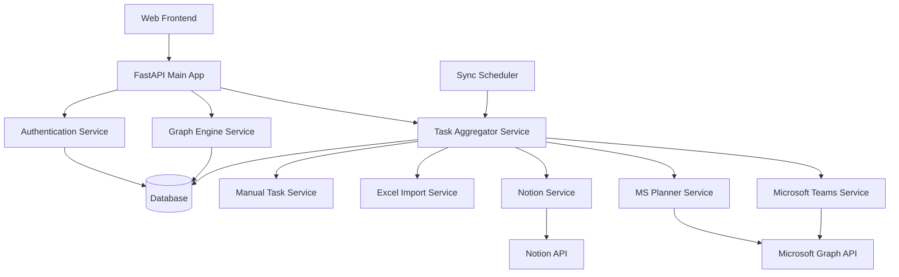

# Design Document

## Overview

The Unified Task Planner is a FastAPI-based web application that aggregates tasks from multiple external platforms into a single, unified interface. The system follows a microservices architecture with specialized services for each integration, a central task aggregator, and a graph engine for dependency analysis and prioritization.

The application builds upon the existing FastAPI foundation and extends it with a robust integration layer, data normalization engine, and intelligent task management capabilities.

## Architecture

### High-Level Architecture



### Service Layer Architecture

The application is structured into distinct service layers:

1. **Presentation Layer**: FastAPI routes and HTML templates
2. **Business Logic Layer**: Task aggregation, graph processing, and business rules
3. **Integration Layer**: External API connectors and data mappers
4. **Data Layer**: Database models and repositories
5. **Infrastructure Layer**: Authentication, scheduling, and cross-cutting concerns

## Components and Interfaces

### Core Services

#### 1. Task Aggregator Service
**Purpose**: Central hub for collecting, normalizing, and deduplicating tasks from all sources.

**Key Interfaces**:
```python
class TaskAggregatorService:
    async def aggregate_all_tasks(user_id: str) -> List[UnifiedTask]
    async def sync_from_source(user_id: str, source: TaskSource) -> SyncResult
    async def create_task(user_id: str, task_data: TaskCreate, target_source: TaskSource) -> UnifiedTask
    async def update_task(user_id: str, task_id: str, updates: TaskUpdate) -> UnifiedTask
    async def delete_task(user_id: str, task_id: str) -> bool
```

#### 2. Graph Engine Service
**Purpose**: Analyze task relationships, compute priorities, and generate dependency graphs.

**Key Interfaces**:
```python
class GraphEngineService:
    async def build_task_graph(user_id: str) -> TaskGraph
    async def compute_priorities(tasks: List[UnifiedTask]) -> List[TaskWithPriority]
    async def add_dependency(user_id: str, parent_task_id: str, child_task_id: str) -> bool
    async def detect_circular_dependencies(user_id: str) -> List[CircularDependency]
```

#### 3. Integration Services
Each external platform has a dedicated service:

**Microsoft Teams Service**:
```python
class MicrosoftTeamsService:
    async def authenticate(user_id: str, auth_code: str) -> AuthResult
    async def fetch_tasks(user_id: str, since: datetime = None) -> List[TeamsTask]
    async def sync_task_status(user_id: str, task_id: str, status: TaskStatus) -> bool
```

**Similar interfaces for MS Planner, Notion, and Excel Import services**

### Authentication & Authorization

**OAuth Integration Manager**:
```python
class OAuthManager:
    async def initiate_oauth_flow(user_id: str, provider: OAuthProvider) -> OAuthUrl
    async def handle_oauth_callback(user_id: str, provider: OAuthProvider, code: str) -> AuthToken
    async def refresh_token(user_id: str, provider: OAuthProvider) -> AuthToken
    async def revoke_access(user_id: str, provider: OAuthProvider) -> bool
```

### Sync Scheduler

**Background Task Scheduler**:
```python
class SyncScheduler:
    async def schedule_sync(user_id: str, source: TaskSource, interval: timedelta) -> None
    async def trigger_immediate_sync(user_id: str, source: TaskSource) -> SyncResult
    async def handle_webhook(source: TaskSource, payload: dict) -> None
```

## Data Models

### Unified Task Schema

```python
class UnifiedTask(BaseModel):
    id: str
    user_id: str
    title: str
    description: Optional[str] = None
    due_date: Optional[datetime] = None
    status: TaskStatus
    priority: Optional[int] = None
    source: TaskSource
    source_id: str  # Original ID from source platform
    source_url: Optional[str] = None
    tags: List[str] = []
    assignee: Optional[str] = None
    created_at: datetime
    updated_at: datetime
    synced_at: datetime

class TaskStatus(str, Enum):
    NOT_STARTED = "not_started"
    IN_PROGRESS = "in_progress"
    COMPLETED = "completed"
    CANCELLED = "cancelled"

class TaskSource(str, Enum):
    MANUAL = "manual"
    MICROSOFT_TEAMS = "microsoft_teams"
    MICROSOFT_PLANNER = "microsoft_planner"
    NOTION = "notion"
    EXCEL_IMPORT = "excel_import"
```

### User Integration Settings

```python
class UserIntegration(BaseModel):
    id: str
    user_id: str
    source: TaskSource
    is_active: bool
    auth_token: Optional[str] = None  # Encrypted
    refresh_token: Optional[str] = None  # Encrypted
    token_expires_at: Optional[datetime] = None
    sync_frequency: timedelta
    last_sync_at: Optional[datetime] = None
    sync_status: SyncStatus
    configuration: Dict[str, Any] = {}  # Source-specific settings
```

### Task Dependencies

```python
class TaskDependency(BaseModel):
    id: str
    user_id: str
    parent_task_id: str
    child_task_id: str
    dependency_type: DependencyType
    created_at: datetime

class DependencyType(str, Enum):
    BLOCKS = "blocks"  # Parent blocks child
    SUBTASK = "subtask"  # Child is subtask of parent
    RELATED = "related"  # Tasks are related
```

## Error Handling

### Error Categories

1. **Authentication Errors**: OAuth failures, token expiration
2. **Integration Errors**: API rate limits, service unavailability
3. **Data Errors**: Malformed data, validation failures
4. **Sync Errors**: Conflict resolution, duplicate detection

### Error Handling Strategy

```python
class TaskPlannerException(Exception):
    def __init__(self, message: str, error_code: str, details: dict = None):
        self.message = message
        self.error_code = error_code
        self.details = details or {}

class IntegrationError(TaskPlannerException):
    pass

class AuthenticationError(TaskPlannerException):
    pass

class SyncError(TaskPlannerException):
    pass
```

### Retry Logic

- **Exponential backoff** for API calls
- **Circuit breaker pattern** for failing services
- **Dead letter queue** for failed sync operations
- **Graceful degradation** when services are unavailable

## Testing Strategy

### Unit Testing
- **Service layer testing**: Mock external APIs, test business logic
- **Data model validation**: Test serialization, validation rules
- **Utility function testing**: Date parsing, data normalization

### Integration Testing
- **API endpoint testing**: Test complete request/response cycles
- **Database integration**: Test data persistence and retrieval
- **External API mocking**: Test integration services with mock responses

### End-to-End Testing
- **User workflow testing**: Complete task aggregation flows
- **Cross-platform sync testing**: Test data consistency across platforms
- **Error scenario testing**: Test error handling and recovery

### Performance Testing
- **Load testing**: Test with large numbers of tasks and users
- **Sync performance**: Test bulk data synchronization
- **Database query optimization**: Test query performance with large datasets

### Security Testing
- **OAuth flow testing**: Test authentication security
- **Data encryption testing**: Test sensitive data protection
- **API security testing**: Test authorization and input validation

## Security Considerations

### Data Protection
- **Encryption at rest**: All sensitive data encrypted in database
- **Encryption in transit**: HTTPS for all API communications
- **Token security**: OAuth tokens encrypted and securely stored

### Authentication & Authorization
- **OAuth 2.0**: Standard OAuth flows for external platform authentication
- **JWT tokens**: Secure session management
- **Role-based access**: User-specific data isolation

### API Security
- **Rate limiting**: Prevent API abuse
- **Input validation**: Sanitize all user inputs
- **CORS configuration**: Secure cross-origin requests

## Deployment Architecture

### Development Environment
- **Local development**: FastAPI with hot reload
- **Database**: SQLite for development
- **External API mocking**: Mock services for testing

### Production Environment
- **Application server**: Uvicorn with multiple workers
- **Database**: PostgreSQL with connection pooling
- **Caching**: Redis for session and data caching
- **Background tasks**: Celery with Redis broker
- **Monitoring**: Application performance monitoring and logging

### Scalability Considerations
- **Horizontal scaling**: Multiple application instances
- **Database optimization**: Indexing and query optimization
- **Caching strategy**: Multi-level caching for frequently accessed data
- **Async processing**: Background task processing for sync operations