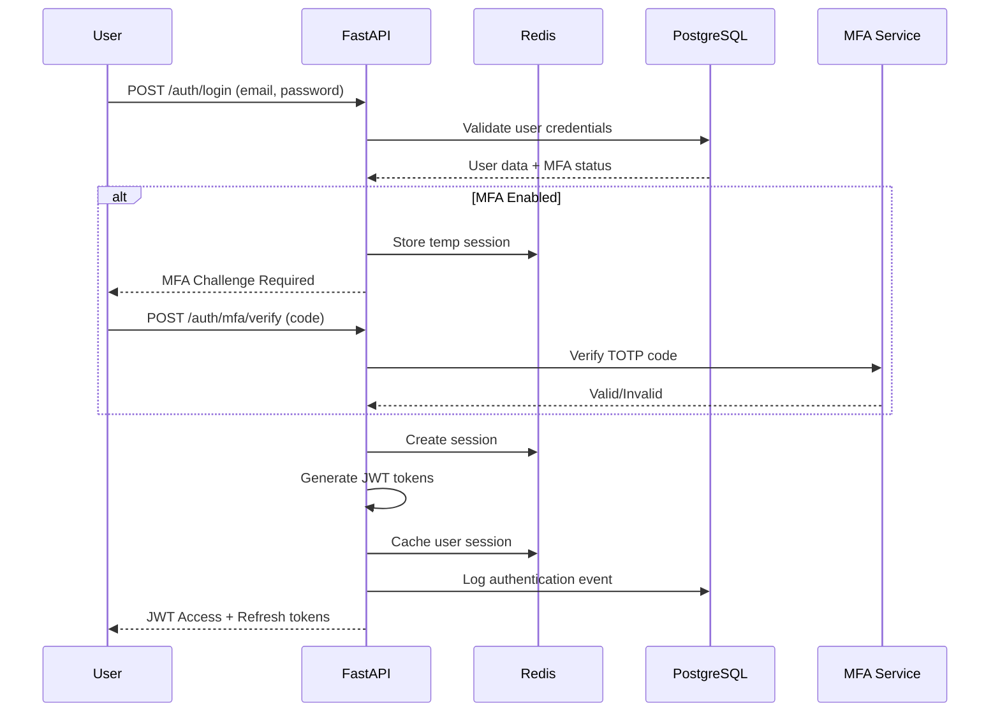
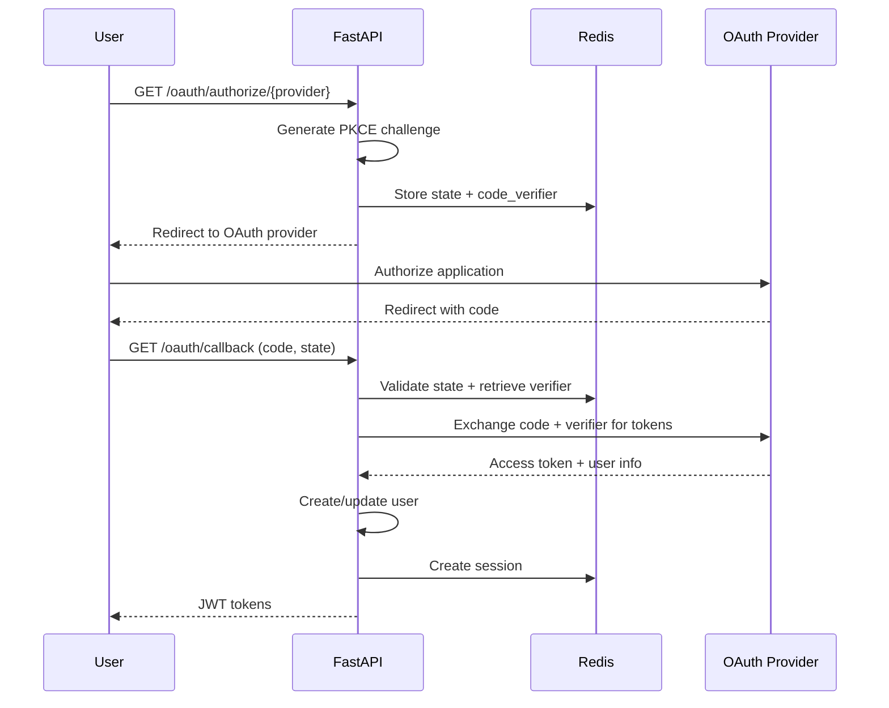

# Enterprise Authentication System Architecture

## System Overview

This document outlines the comprehensive architecture for upgrading the Ultimate Planner authentication system to enterprise-grade standards with enhanced security, scalability, and compliance features.

## Current State Analysis

### Existing Foundation ✅
- **FastAPI Framework**: Robust async web framework
- **SQLAlchemy ORM**: Database abstraction layer
- **JWT Authentication**: Token-based authentication
- **OAuth Framework**: Microsoft & Notion provider integrations
- **PostgreSQL Database**: Production-ready database
- **Basic User Management**: Registration, login, user models

### Critical Gaps Identified 🚨
- **Multi-Factor Authentication (MFA)**: No TOTP/SMS support
- **PKCE Implementation**: OAuth security enhancement missing
- **Rate Limiting**: No protection against brute force attacks
- **Session Management**: No Redis-based session store
- **Audit Logging**: Limited security event tracking
- **Role-Based Access Control**: No granular permissions
- **Token Blacklisting**: No JWT revocation mechanism

## Enterprise Architecture Design

### 1. System Architecture Overview

```
┌─────────────────────────────────────────────────────────────────┐
│                    Load Balancer (Nginx/HAProxy)                │
└─────────────────────┬───────────────────────────────────────────┘
                      │
┌─────────────────────┴───────────────────────────────────────────┐
│                   FastAPI Application Layer                     │
├─────────────────────┬───────────────────────────────────────────┤
│     Auth Service    │    Rate Limiter   │   Audit Logger       │
│   (JWT + OAuth)     │   (FastAPI-limiter)│   (Structured logs) │
└─────────────────────┼───────────────────┼───────────────────────┘
                      │                   │
┌─────────────────────┼───────────────────┼───────────────────────┐
│                Redis Cluster                                    │
│  ┌─────────────────┐  ┌─────────────────┐  ┌─────────────────┐ │
│  │   Sessions      │  │  Rate Limits    │  │  Token Blacklist│ │
│  │   Cache         │  │   Cache         │  │     Cache       │ │
│  └─────────────────┘  └─────────────────┘  └─────────────────┘ │
└─────────────────────────────────────────────────────────────────┘
                      │
┌─────────────────────┼───────────────────────────────────────────┐
│                PostgreSQL Cluster                               │
│  ┌─────────────────┐  ┌─────────────────┐  ┌─────────────────┐ │
│  │   User Data     │  │   Audit Logs    │  │   MFA Secrets   │ │
│  │   OAuth Tokens  │  │   Security Events│  │   Backup Codes │ │
│  └─────────────────┘  └─────────────────┘  └─────────────────┘ │
└─────────────────────────────────────────────────────────────────┘
```

### 2. Authentication Flow Architecture

#### 2.1 Standard Login Flow with MFA


#### 2.2 OAuth 2.1 with PKCE Flow


### 3. Database Schema Evolution

#### 3.1 Enhanced User Model
```sql
-- Extended users table
ALTER TABLE users ADD COLUMN mfa_enabled BOOLEAN DEFAULT FALSE;
ALTER TABLE users ADD COLUMN mfa_secret_encrypted TEXT;
ALTER TABLE users ADD COLUMN backup_codes_hash TEXT;
ALTER TABLE users ADD COLUMN password_changed_at TIMESTAMP;
ALTER TABLE users ADD COLUMN failed_login_attempts INTEGER DEFAULT 0;
ALTER TABLE users ADD COLUMN locked_until TIMESTAMP;
ALTER TABLE users ADD COLUMN last_login_at TIMESTAMP;
ALTER TABLE users ADD COLUMN last_login_ip INET;
```

#### 3.2 New Security Tables
```sql
-- User MFA configurations
CREATE TABLE user_mfa_configs (
    id UUID PRIMARY KEY DEFAULT gen_random_uuid(),
    user_id UUID NOT NULL REFERENCES users(id) ON DELETE CASCADE,
    method VARCHAR(20) NOT NULL, -- 'totp', 'sms', 'email'
    secret_encrypted TEXT NOT NULL,
    backup_codes_hash TEXT,
    is_verified BOOLEAN DEFAULT FALSE,
    created_at TIMESTAMP WITH TIME ZONE DEFAULT NOW(),
    verified_at TIMESTAMP WITH TIME ZONE
);

-- Session management
CREATE TABLE user_sessions (
    id UUID PRIMARY KEY DEFAULT gen_random_uuid(),
    user_id UUID NOT NULL REFERENCES users(id) ON DELETE CASCADE,
    session_token_hash VARCHAR(128) UNIQUE NOT NULL,
    refresh_token_hash VARCHAR(128) UNIQUE NOT NULL,
    device_info JSONB,
    ip_address INET,
    user_agent TEXT,
    expires_at TIMESTAMP WITH TIME ZONE NOT NULL,
    created_at TIMESTAMP WITH TIME ZONE DEFAULT NOW(),
    last_used_at TIMESTAMP WITH TIME ZONE DEFAULT NOW()
);

-- Audit logging
CREATE TABLE security_audit_logs (
    id UUID PRIMARY KEY DEFAULT gen_random_uuid(),
    user_id UUID REFERENCES users(id),
    event_type VARCHAR(50) NOT NULL, -- 'login', 'logout', 'mfa_verify', 'password_change'
    event_data JSONB,
    ip_address INET,
    user_agent TEXT,
    success BOOLEAN NOT NULL,
    created_at TIMESTAMP WITH TIME ZONE DEFAULT NOW()
);

-- Role-based access control
CREATE TABLE roles (
    id UUID PRIMARY KEY DEFAULT gen_random_uuid(),
    name VARCHAR(50) UNIQUE NOT NULL,
    description TEXT,
    permissions JSONB NOT NULL, -- Array of permission strings
    created_at TIMESTAMP WITH TIME ZONE DEFAULT NOW()
);

CREATE TABLE user_roles (
    user_id UUID NOT NULL REFERENCES users(id) ON DELETE CASCADE,
    role_id UUID NOT NULL REFERENCES roles(id) ON DELETE CASCADE,
    granted_at TIMESTAMP WITH TIME ZONE DEFAULT NOW(),
    granted_by UUID REFERENCES users(id),
    PRIMARY KEY (user_id, role_id)
);

-- Token blacklist for JWT revocation
CREATE TABLE blacklisted_tokens (
    jti VARCHAR(128) PRIMARY KEY, -- JWT ID
    user_id UUID NOT NULL REFERENCES users(id) ON DELETE CASCADE,
    token_type VARCHAR(20) NOT NULL, -- 'access' or 'refresh'
    expires_at TIMESTAMP WITH TIME ZONE NOT NULL,
    blacklisted_at TIMESTAMP WITH TIME ZONE DEFAULT NOW()
);
```

#### 3.3 Indexing Strategy
```sql
-- Performance indexes
CREATE INDEX idx_users_email_active ON users(email) WHERE is_active = TRUE;
CREATE INDEX idx_user_sessions_user_expires ON user_sessions(user_id, expires_at);
CREATE INDEX idx_audit_logs_user_time ON security_audit_logs(user_id, created_at);
CREATE INDEX idx_audit_logs_event_time ON security_audit_logs(event_type, created_at);
CREATE INDEX idx_blacklisted_tokens_expires ON blacklisted_tokens(expires_at);

-- Partial indexes for performance
CREATE INDEX idx_failed_logins ON users(email) WHERE failed_login_attempts > 0;
CREATE INDEX idx_locked_users ON users(id) WHERE locked_until > NOW();
```

### 4. API Architecture Design

#### 4.1 Authentication Endpoints
```
POST   /auth/register              - User registration
POST   /auth/login                 - Standard login
POST   /auth/refresh               - Token refresh
POST   /auth/logout                - User logout
POST   /auth/logout-all            - Logout all devices

# MFA Endpoints
POST   /auth/mfa/setup             - Initialize MFA setup
POST   /auth/mfa/verify-setup      - Complete MFA setup
POST   /auth/mfa/verify            - Verify MFA code during login
GET    /auth/mfa/backup-codes      - Generate backup codes
POST   /auth/mfa/disable           - Disable MFA

# Password Management
POST   /auth/password/change       - Change password (authenticated)
POST   /auth/password/reset        - Request password reset
POST   /auth/password/reset/verify - Complete password reset

# OAuth Endpoints
GET    /oauth/authorize/{provider} - Initiate OAuth flow
GET    /oauth/callback/{provider}  - Handle OAuth callback
DELETE /oauth/revoke/{provider}    - Revoke OAuth access
```

#### 4.2 Admin Management Endpoints
```
# User Management
GET    /admin/users                - List users (paginated)
GET    /admin/users/{user_id}      - Get user details
PUT    /admin/users/{user_id}      - Update user
DELETE /admin/users/{user_id}      - Deactivate user
POST   /admin/users/{user_id}/unlock - Unlock locked user

# Role Management
GET    /admin/roles                - List roles
POST   /admin/roles                - Create role
PUT    /admin/roles/{role_id}      - Update role
DELETE /admin/roles/{role_id}      - Delete role
POST   /admin/users/{user_id}/roles/{role_id} - Assign role
DELETE /admin/users/{user_id}/roles/{role_id} - Remove role

# Security Monitoring
GET    /admin/audit-logs           - Get audit logs (filtered)
GET    /admin/sessions             - List active sessions
DELETE /admin/sessions/{session_id} - Terminate session
GET    /admin/security-stats       - Security metrics
```

### 5. Security Implementation Strategy

#### 5.1 Multi-Factor Authentication
```python
# MFA Service Architecture
class MFAService:
    def __init__(self, redis_client, db_session):
        self.redis = redis_client
        self.db = db_session
        self.totp = PyOTP()
    
    async def setup_totp(self, user_id: str) -> MFASetupResult:
        """Generate TOTP secret and QR code"""
        secret = self.totp.random_base32()
        encrypted_secret = encrypt_sensitive_data(secret)
        
        # Store temporarily until verified
        await self.redis.setex(
            f"mfa_setup:{user_id}", 
            300,  # 5 minutes
            encrypted_secret
        )
        
        qr_url = self.totp.provisioning_uri(
            name=user.email,
            issuer_name="Ultimate Planner"
        )
        
        return MFASetupResult(
            secret=secret,
            qr_code_url=qr_url,
            backup_codes=self.generate_backup_codes()
        )
```

#### 5.2 Rate Limiting Strategy
```python
# Multi-level rate limiting
RATE_LIMITS = {
    "auth_login": "5/minute",           # 5 login attempts per minute
    "auth_mfa_verify": "3/minute",      # 3 MFA attempts per minute  
    "password_reset": "3/hour",         # 3 password resets per hour
    "api_general": "1000/hour",         # General API limit
    "oauth_callback": "10/minute",      # OAuth callback limit
}

# IP-based and user-based rate limiting
@limiter.limit("5/minute")
@limiter.limit("20/minute", key_func=get_user_id)
async def login_endpoint():
    pass
```

#### 5.3 JWT Security Enhancement
```python
# Enhanced JWT configuration
JWT_CONFIG = {
    "access_token_expire_minutes": 15,
    "refresh_token_expire_days": 30,
    "algorithm": "RS256",  # RSA signing
    "issuer": "ultimate-planner",
    "audience": "ultimate-planner-api",
}

# Token blacklisting with Redis
class JWTBlacklistService:
    async def blacklist_token(self, jti: str, expires_at: datetime):
        await self.redis.setex(
            f"blacklisted:{jti}",
            int((expires_at - datetime.utcnow()).total_seconds()),
            "1"
        )
    
    async def is_blacklisted(self, jti: str) -> bool:
        return await self.redis.exists(f"blacklisted:{jti}")
```

### 6. Performance & Scalability Architecture

#### 6.1 Redis Caching Strategy
```python
# Redis cluster configuration
REDIS_CONFIG = {
    "sessions": {
        "prefix": "sess:",
        "ttl": 1800,  # 30 minutes
    },
    "rate_limits": {
        "prefix": "rl:",
        "ttl": 3600,  # 1 hour
    },
    "mfa_challenges": {
        "prefix": "mfa:",
        "ttl": 300,   # 5 minutes
    },
    "oauth_states": {
        "prefix": "oauth:",
        "ttl": 600,   # 10 minutes
    }
}
```

#### 6.2 Database Connection Pooling
```python
# Production database configuration
DATABASE_CONFIG = {
    "pool_size": 20,
    "max_overflow": 30,
    "pool_pre_ping": True,
    "pool_recycle": 3600,
    "echo": False,
}

# Read replica configuration for audit logs
AUDIT_DB_CONFIG = {
    "read_replica_url": os.getenv("AUDIT_DATABASE_READ_URL"),
    "pool_size": 10,
    "max_overflow": 20,
}
```

### 7. Compliance & Security Standards

#### 7.1 GDPR Compliance
- **Data Minimization**: Store only necessary user data
- **Right to be Forgotten**: Complete user data deletion
- **Data Portability**: User data export functionality  
- **Consent Management**: Explicit consent tracking
- **Breach Notification**: Automated alert system

#### 7.2 SOC 2 Type II Controls
- **Access Controls**: Role-based permissions
- **Encryption**: Data at rest and in transit
- **Audit Logging**: Comprehensive security event logging
- **Monitoring**: Real-time security alerts
- **Backup & Recovery**: Automated backup procedures

#### 7.3 NIST Cybersecurity Framework
- **Identify**: Asset inventory and risk assessment
- **Protect**: Access controls, data security, awareness
- **Detect**: Security monitoring and anomaly detection
- **Respond**: Incident response procedures
- **Recover**: Backup and disaster recovery plans

### 8. Monitoring & Observability

#### 8.1 Security Metrics
```python
# Key security metrics to track
SECURITY_METRICS = {
    "authentication_attempts": "Counter",
    "failed_login_attempts": "Counter", 
    "mfa_verification_attempts": "Counter",
    "token_refresh_rate": "Histogram",
    "session_duration": "Histogram",
    "oauth_callback_success_rate": "Gauge",
}
```

#### 8.2 Alerting Strategy
- **Failed login threshold**: >10 attempts in 5 minutes
- **MFA bypass attempts**: Any attempts to bypass MFA
- **Token manipulation**: Invalid JWT signatures
- **Mass logout events**: >50% of users logged out
- **Database connection issues**: Connection pool exhaustion

### 9. Deployment Architecture

#### 9.1 Container Configuration
```dockerfile
# Production Dockerfile optimizations
FROM python:3.11-slim
WORKDIR /app

# Security: Non-root user
RUN groupadd -r appuser && useradd -r -g appuser appuser

# Dependencies
COPY requirements.txt .
RUN pip install --no-cache-dir -r requirements.txt

# Application code
COPY app/ ./app/
RUN chown -R appuser:appuser /app
USER appuser

# Health check
HEALTHCHECK --interval=30s --timeout=10s --start-period=60s \
  CMD curl -f http://localhost:8000/health || exit 1

EXPOSE 8000
CMD ["uvicorn", "app.main:app", "--host", "0.0.0.0", "--port", "8000"]
```

#### 9.2 Kubernetes Deployment
```yaml
# Production Kubernetes configuration
apiVersion: apps/v1
kind: Deployment
metadata:
  name: ultimate-planner-auth
spec:
  replicas: 3
  strategy:
    type: RollingUpdate
    rollingUpdate:
      maxSurge: 1
      maxUnavailable: 0
  template:
    spec:
      containers:
      - name: auth-service
        image: ultimate-planner:latest
        resources:
          requests:
            memory: "512Mi"
            cpu: "250m"
          limits:
            memory: "1Gi" 
            cpu: "500m"
        env:
        - name: DATABASE_URL
          valueFrom:
            secretKeyRef:
              name: database-secret
              key: url
        livenessProbe:
          httpGet:
            path: /health
            port: 8000
          initialDelaySeconds: 30
          periodSeconds: 10
```

### 10. Implementation Roadmap

#### Phase 1: Foundation (Weeks 1-2)
1. Redis integration and session management
2. Enhanced database schema migration
3. JWT security improvements with blacklisting
4. Basic rate limiting implementation

#### Phase 2: MFA & Security (Weeks 3-4) 
1. TOTP-based MFA implementation
2. Backup codes system
3. OAuth 2.1 with PKCE upgrade
4. Comprehensive audit logging

#### Phase 3: Administration (Weeks 5-6)
1. Admin dashboard and user management
2. Role-based access control
3. Security monitoring and alerting
4. Compliance reporting features

#### Phase 4: Scale & Deploy (Weeks 7-8)
1. Performance optimization and caching
2. Container orchestration setup
3. Monitoring and observability
4. Production deployment and testing

## Architecture Decision Records (ADRs)

### ADR-001: Redis for Session Management
**Decision**: Use Redis for session storage instead of database-only sessions
**Rationale**: Better performance, automatic expiration, distributed caching
**Consequences**: Additional infrastructure dependency, improved scalability

### ADR-002: RS256 JWT Signing
**Decision**: Use RS256 (RSA) instead of HS256 (HMAC) for JWT signing  
**Rationale**: Better security for distributed systems, key rotation capability
**Consequences**: Slightly higher CPU usage, enhanced security

### ADR-003: TOTP over SMS for MFA
**Decision**: Implement TOTP as primary MFA method
**Rationale**: Better security, no SMS costs, offline capability
**Consequences**: User education needed, backup codes required

This architecture provides a robust, scalable, and secure foundation for enterprise-grade authentication while maintaining compatibility with the existing FastAPI structure.